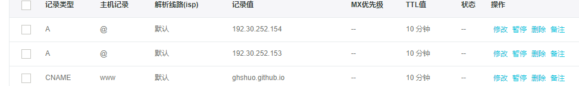

### hexo 下的分类和表签无法显示，解决方法
    打开页面的时候标签和分类总是提示Cannot GET /tags/这个错误 
#### 新建一个页面
		$ hexo new page "tags"

#### 设置新建页面的类型

（\source\tags\index.md中查找设置）
```
---
title: tags	
date: 2017-11-12 22:06:40
tags: tags  #文章的标签
---
注意：冒号后面都需要添加一个空格
```

#### 配置主题文件

（主题_config.yml中设置）
```
menu:
  home: / || home	
  tags: /tags/ || tags  #确保已经打开

```
#### 重新生成生成

```
hexo generate
hexo server
```

```
如果上述都设置都没有问题还是不能生成页面
看下是不是有缓存，清除下缓存
看下你下载的主题是不是从官网上下载的  
你下载从别人下载的会有些东西已经集成到了主题里的，建议你从官网上下载一个主题重新生成下 
我用的是这个next
[next主题下载官方文档](http://theme-next.iissnan.com/getting-started.html) 
```
### github上建立仓库注意点
		设置仓库名字的时候 ghshuo.github.io ，其中ghshuo 必须要是你的用户名，其它名称无效
		将来你的网站访问地址就是 http://ghshuo.github.io 

#### 绑定自己的域名
```
记录类型选A或CNAME，A记录的记录值就是ip地址，
github(官方文档)提供了两个IP地址，192.30.252.153和192.30.252.154，
这两个IP地址为github的服务器地址，两个都要填上，解析记录设置两个www和@，线路就默认就行了，
CNAME记录值填你的github博客网址

在source文件夹中新建一个CNAME文件（无后缀名），然后用文本编辑器打开，在首行添加你的网站域名，
如http://xxxx.com，注意前面没有http://，也没有www，
然后使用hexo g 
hexo d上传部署。



  最后一步：在根目录source中添加 CNAME文件（不需要添加任何后戳） 文件中写上你的域名
```
### hexo文章中添加图片

每次要把图片先上传到七牛的服务器然后再使用有点麻烦，下面的方法在本地加载

#### 修改主配置
主页配置中 _config.yml 中有 post_asset_folder: true    如果是flase 改成true

#### hexo目录中执行
npm install https://github.com/CodeFalling/hexo-asset-image --save

#### 生成新的文章

```
$ hexo new [hexo-pit] <title> 建一篇新文章hexo-pit 
下面会多出一个和新建文章hexo-pit名字一样的文件夹，这样也可以方便你管理文件资源。
\source\_posts\下面会生成hexo-pit文件夹 如下：

生成html是
```

### 参考

link [next主题美化](https://segmentfault.com/a/1190000009544924)
link [hexo搭建博客](http://www.cnblogs.com/zhcncn/p/4097881.html)
          